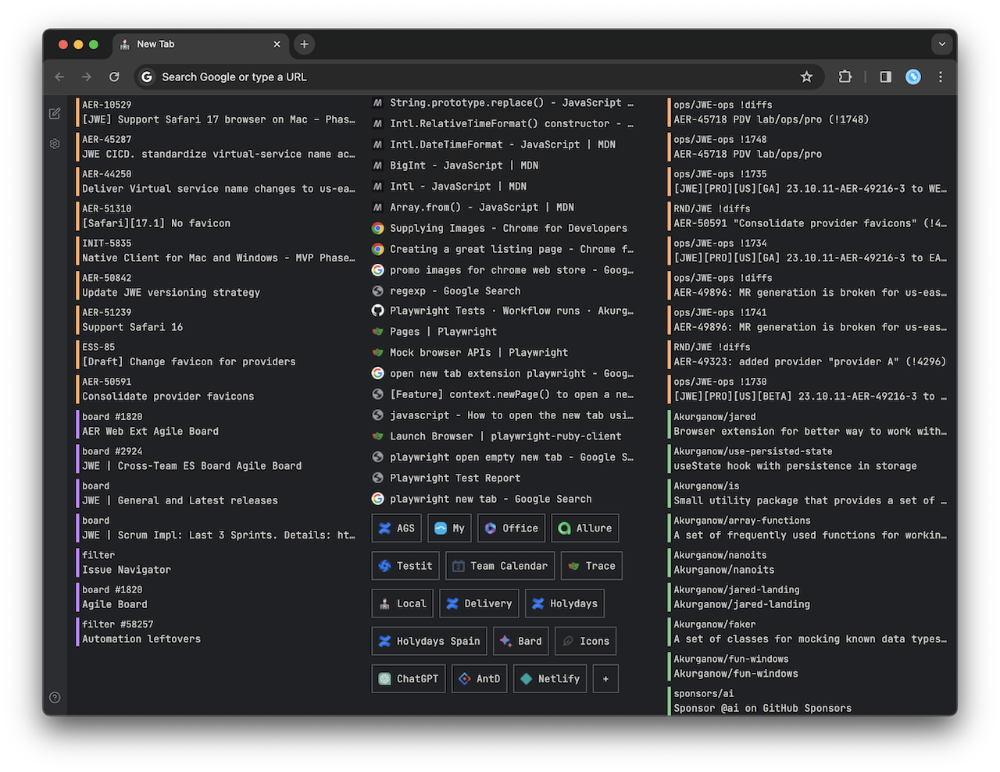

import {emojiListItems} from "../utils/emoji";
---
title: 'Jared Web Extension'
---

import { SEO } from "../components/SEO"
import EmojiList from '../components/EmojiList'

export function Head() {
	return <SEO />
}

# Welcome to Jared

🚀 **Elevate Your Browsing with Elegance!** 🌟

Say goodbye to the mundane new tab page. Introducing **[Jared](https://chrome.google.com/webstore/detail/jared/aafbpehebcbadcpmmmkjgednfoojpifa)**, the Chrome extension that revolutionizes your browsing experience.

🔥 **Features at a Glance:**

<EmojiList items={homePageItems} />

🔗 Ready to upgrade your browsing? [Get Jared now on the Chrome Web Store!](https://chrome.google.com/webstore/detail/jared/aafbpehebcbadcpmmmkjgednfoojpifa)

👨‍💻 **Attention Developers!** Jared is an open-source project, and we welcome contributions from the developer community. Whether it's fixing bugs, adding new features, or improving the code, your input can make a big difference.

🔗 Interested in contributing? Check out the project on [GitHub](https://github.com/Akurganow/jared) and join our growing community of developers!

